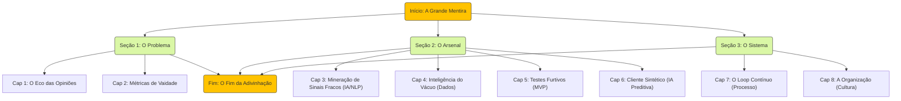

# Verdades Ocultas: Processos Inovadores para Entender o que os Clientes Realmente Querem (Antes Deles Mesmos)

## Introdução — A Grande Mentira
- **Problema:** Clientes mentem sem querer porque respondem com o que acham que você quer ouvir.
- **Tese:** Diferencie feedback declarado do comportamento real; o que dizem raramente bate com o que fazem às 3 da manhã.
- **Promessa:** Trocar mapas de empatia por painéis de previsão que observam, modelam e antecipam necessidades.

## Seção 1 — A Morte da Pesquisa (O que está quebrado)
### Capítulo 1 — O Eco das Opiniões
- Focus groups e pesquisas reforçam viés de confirmação.
- O dilema "cliente Henry Ford": pedem cavalos mais rápidos, não carros.
- Custo de ouvir clientes errados: early adopters barulhentos obscurecem a maioria silenciosa.

### Capítulo 2 — Métricas de Vaidade vs. Sinais de Fumaça
- NPS/CSAT são indicadores do passado, não sensores do futuro.
- Sinais reais de descontentamento vivem em tickets de suporte, reviews 3★, fóruns como Reddit.

## Seção 2 — O Arsenal Inovador (Os novos processos)
### Capítulo 3 — Mineração de Sinais Fracos (Escuta Passiva)
- Use IA/NLP para captar conversas naturais (social, Reclame Aqui, comunidades).
- Transforme reclamações de suporte em backlog de inovação.
- Case: reviews na App Store revelando features milionárias.

### Capítulo 4 — Inteligência do Vácuo (Análise de Abandono)
- O que o cliente não faz importa mais do que o que ele faz.
- Analise rage clicks, dead clicks e jornadas abandonadas (heatmaps + funis).
- Carrinhos abandonados expõem hipóteses erradas sobre preço/valor.

### Capítulo 5 — Laboratório de Testes Rápidos (Validação Furtiva)
- Teste ideias sem construir produto completo.
- Técnicas: Porta Falsa (feature anunciada que não existe) e Mágico de Oz (humano atrás da automação).

### Capítulo 6 — Cliente Sintético (Simulação Preditiva)
- Use IA generativa para simular clientes com dados reais.
- Crie personas de IA treinadas em suporte/comportamento.
- Rode focus groups com 10.000 clientes sintéticos em minutos.

## Seção 3 — O Sistema Operacional (Como implementar)
### Capítulo 7 — O Loop de Descoberta Contínua
- Saia de projetos pontuais, crie fluxo contínuo de inteligência.
- Integre sinais fracos e vazios diretamente em Kanban/Scrum.
- Product Manager atua como antropólogo de dados.

### Capítulo 8 — A Organização que Aprende
- Cultura: engenharia, marketing e C-level trocam opinião por evidência comportamental.
- Dashboard que importa: taxa de acerto das previsões sobre clientes.

## Conclusão — O Fim da Adivinhação
- Futuro pertence a quem ouve mais rápido, não a quem pergunta melhor.
- Próximo passo: empresa como organismo vivo que adapta-se em tempo real à verdade do cliente.

## Mapa Mental Rápido

Esse sumário é o "Mapa da Verdade do Cliente": ataca o problema, apresenta o arsenal de IA/dados e finaliza com o sistema operacional contínuo.
